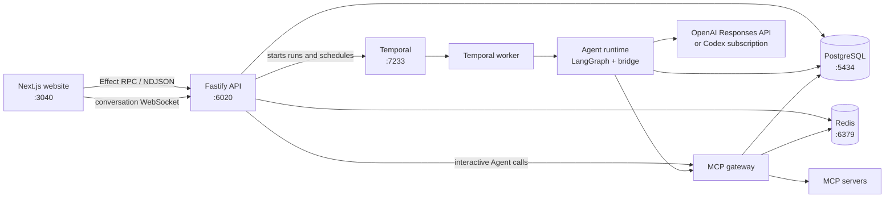

# Agents

Agents is a controlled workspace for connecting user-owned [Model Context Protocol (MCP)](https://modelcontextprotocol.io/) servers to AI conversations and durable automations.

The product has three conversation modes:

- **Chat** streams a model response without calling tools.
- **Agent** can call enabled MCP tools during an interactive conversation, subject to the user's approval policy.
- **Automation** helps the user turn a conversation into a reviewable Run Brief and an approved Automation that can run now or on a Temporal schedule.

Nothing proposed by the model becomes an active Automation by itself. The API validates and persists a Run Brief, tool authorizations, schedule, budget, and approval before durable execution can start.

## System overview



The HTTP API updates product state and starts Temporal work; it does not execute durable Automation runs itself. `apps/worker` hosts the Temporal worker, while `packages/agent-runtime` owns the workflow and activity implementation.

## End-to-end flows

### Interactive conversation

1. The browser authenticates with Stytch, or with the non-production development bypass.
2. The website creates and loads Conversations through typed Effect RPC calls. Next.js rewrites `/api/rpc` to the Fastify `/rpc` endpoint.
3. The conversation page opens `/ws/conversations/:conversationId` directly against the API.
4. The API persists the user message, streams model text and safe reasoning summaries, and persists the final assistant message plus its activity timeline.
5. The client reconciles optimistic text, activity snapshots, deltas, tool approvals, failures, and reconnects from the WebSocket protocol defined in `packages/contracts`.

In **Chat** mode, the model receives conversation history and the names of available tools as suggestions, but it cannot execute them.

In **Agent** mode, the model receives the enabled tools discovered from connected MCP servers. Each requested call is checked against the user's interactive approval preference and the tool's policy. Calls that require approval pause the turn until the user chooses **Allow once** or **Deny**. Completed calls are fed back to the model until it answers, fails, or reaches the eight-step limit. Interactive turns run inside the API WebSocket process rather than Temporal.

In **Automation** mode, the model may emit a structured Automation proposal. That proposal is only conversation metadata until the user reviews the generated Run Brief and approves the resulting Automation.

### Automation lifecycle

```text
Conversation
  -> Automation proposal
  -> versioned Run Brief draft
  -> approved Run Brief + frozen tool authorizations
  -> approved Automation Version
  -> manual or scheduled Automation Run
  -> append-only Run Steps + encrypted Artifacts + final output
```

Approval performs deterministic validation outside the model. It checks the brief, selected tools, write-capable acknowledgements, schedule rule, run budget, output destination, connection state, and current tool metadata. Recurring Automations are synchronized to a Temporal Schedule named `automation:<automationId>`.

Both **Run now** and scheduled triggers create a durable Run and start the same `runWorkflow` with a workflow ID derived from the database ID: `run:<runId>`. The worker then:

1. Loads the approved Run Brief and authorization snapshots.
2. Advances the LangGraph state to the next durable operation.
3. Executes model calls, MCP calls, artifact writes, checkpoint saves, and Run Step writes as Temporal Activities.
4. Accumulates LLM, tool-call, runtime, output-size, token, retry, and spend usage against the Run Budget.
5. Persists terminal state, visible Run Steps, encrypted Artifacts, and failure details.

Scheduled runs never stop for a surprise approval. Their execution policy permits only the tools frozen into the approved Automation Version.

### MCP connection and execution

The MCP gateway is the only boundary that executes MCP tools. It supports Streamable HTTP and SSE servers with no authentication, bearer tokens, custom headers, OAuth 2, or automatic authentication discovery.

When a connection is created or refreshed, the gateway:

1. Validates the endpoint and blocks unsafe URLs by default.
2. Encrypts credentials before persistence.
3. Connects to the server and discovers its tools.
4. Stores tool schemas, annotations, hashes, availability, and per-tool approval policy.

Before execution, the gateway checks ownership, connection and tool state, authorization snapshots, schema and annotation fingerprints, idempotency, and write boundaries. Arguments and raw results are stored as encrypted Artifacts; public timelines receive allowlisted metadata and redacted summaries.

## Repository layout

| Path | Responsibility |
| --- | --- |
| `apps/website` | Next.js 16 and React 19 UI for authentication, conversations, connections, Automations, settings, and Run history. |
| `apps/api` | Fastify HTTP/WebSocket server, Stytch authentication, Effect RPC handlers, interactive Agent loop, and Temporal client calls. |
| `apps/worker` | Small executable that registers the Temporal workflows and Activities on the configured task queue. |
| `packages/contracts` | Shared Effect schemas, RPC definitions, conversation streaming protocol, Run Brief validation, activation rules, and public Run-history projection. |
| `packages/db` | Drizzle schema, migrations, repositories, owner-scoped reads/writes, Run state, and encrypted Artifact storage. |
| `packages/mcp-gateway` | MCP discovery, OAuth, encrypted credentials, endpoint safety, tool policy, authorization enforcement, execution, idempotency, and audit persistence. |
| `packages/agent-runtime` | Model provider, interactive Agent helpers, LangGraph state machine, Temporal workflows/Activities, scheduling, checkpoints, and budget accounting. |
| `scripts/dev` | Local development helpers, including the deterministic MCP smoke server. |
| `docs/superpowers` | Design specifications and implementation plans for major product changes. |
| `CONTEXT.md` | Product language and architectural decisions. |
| `TODO.md` | Full V1 direction and follow-up hardening; it is not a statement that every listed item is complete. |

## Data and infrastructure

PostgreSQL is the application source of truth. The current schema includes users and personal workspaces, MCP connections and tools, Conversations and append-only messages, interactive Agent turns, Run Briefs and immutable versions, Automations and immutable versions, Runs and Run Steps, audit events, activity timelines, and encrypted Artifacts.

Redis stores short-lived MCP OAuth state. Temporal provides durable run orchestration and recurring schedules. The local Temporal development server uses SQLite internally, independently of the application database.

Raw Artifact payloads use AES-256-GCM envelope metadata and are stored in PostgreSQL for local V1. `ArtifactStorageAdapter` is the boundary for moving raw payloads to object storage later. Credentials and Artifact payloads use separate encryption keys.

## Prerequisites

- Node.js `>=24 <27` (`.node-version` currently pins Node 24)
- pnpm `11.19.0`
- Docker with Docker Compose
- An OpenAI API key, a local Codex ChatGPT login, or deterministic fallback mode
- Stytch credentials, unless using the local development authentication bypass

## Local setup

Install and configure the repository from its root.

```bash
cp apps/api/.env.example .env
cp apps/website/.env.example apps/website/.env.local
```

The API, worker, migrations, and mock MCP server read the root `.env`. Next.js reads `apps/website/.env.local`.

Generate two different 32-byte base64url keys and set them as `MCP_CREDENTIALS_ENCRYPTION_KEY` and `ARTIFACT_ENCRYPTION_KEY` in `.env`:

```bash
node -e "console.log(require('node:crypto').randomBytes(32).toString('base64url'))"
```

Choose one model authentication mode in `.env`:

| Mode | Configuration |
| --- | --- |
| OpenAI API | Set `MODEL_AUTH_MODE=api_key` and `OPENAI_API_KEY`. |
| Codex subscription | Run `codex login`, then set `MODEL_AUTH_MODE=codex_subscription`. `CODEX_HOME` defaults to `~/.codex`. |
| Automatic | Set `MODEL_AUTH_MODE=auto`; API key wins, then Codex auth, then fallback. |
| Offline fallback | Set `MODEL_AUTH_MODE=fallback` for deterministic responses without network model calls. |

For local development without Stytch, add the following values.

Root `.env`:

```dotenv
AUTH_DEV_BYPASS=true
MODEL_AUTH_MODE=fallback
```

`apps/website/.env.local`:

```dotenv
NEXT_PUBLIC_DEV_AUTH_ENABLED=true
NEXT_PUBLIC_DEV_AUTH_USER_ID=local
```

The bypass is ignored when `NODE_ENV=production`.

Then prepare the workspace:

```bash
make setup
```

This installs the locked dependencies, starts PostgreSQL, Redis, and Temporal, and applies the Drizzle migrations.

Start the full stack:

```bash
make dev
```

`make dev` starts the website, API, worker, infrastructure, and deterministic MCP smoke server. Open:

- Website: [http://localhost:3040](http://localhost:3040)
- API health: [http://localhost:6020](http://localhost:6020)
- Temporal UI: [http://localhost:8233](http://localhost:8233)
- Local MCP endpoint: `http://127.0.0.1:8787/mcp`

To connect the local MCP smoke server, development-only private HTTP access must be enabled in `.env`:

```dotenv
MCP_ALLOW_INSECURE_HTTP=true
MCP_ALLOW_PRIVATE_NETWORKS=true
```

Create a Streamable HTTP connection with no authentication at `http://127.0.0.1:8787/mcp`. The server exposes a deterministic, read-only `get_watchlist_news` tool. Never enable these two flags in production.

## Environment reference

| Variable | Used by | Purpose |
| --- | --- | --- |
| `DATABASE_URL` | API, worker, migrations | PostgreSQL connection string. |
| `REDIS_URL` | MCP gateway | Redis connection for OAuth state. |
| `TEMPORAL_ADDRESS`, `TEMPORAL_NAMESPACE`, `TEMPORAL_TASK_QUEUE` | API, worker | Temporal client and worker routing. |
| `STYTCH_PROJECT_ID`, `STYTCH_SECRET`, `STYTCH_ENV` | API | Session authentication. |
| `NEXT_PUBLIC_STYTCH_PUBLIC_TOKEN` | website | Stytch browser client. |
| `APP_URL` | API, MCP gateway | Allowed website origin and OAuth callback base. |
| `BACKEND_URL` | website server | Next.js RPC rewrite destination. |
| `NEXT_PUBLIC_BACKEND_WS_URL` | website browser | Direct conversation WebSocket base URL. |
| `MCP_CREDENTIALS_ENCRYPTION_KEY` | MCP gateway | Encrypts bearer, header, and OAuth credentials. |
| `ARTIFACT_ENCRYPTION_KEY`, `ARTIFACT_ENCRYPTION_KEY_ID`, `ARTIFACT_ENCRYPTION_KEY_VERSION` | database package | Encrypts raw Artifact payloads and records key metadata. |
| `MODEL_AUTH_MODE`, `OPENAI_API_KEY`, `OPENAI_MODEL`, `CODEX_HOME` | agent runtime | Selects model authentication and model. |
| `AUTH_DEV_BYPASS`, `NEXT_PUBLIC_DEV_AUTH_ENABLED`, `NEXT_PUBLIC_DEV_AUTH_USER_ID` | API and website | Enables the non-production local identity. |
| `MCP_ALLOW_INSECURE_HTTP`, `MCP_ALLOW_PRIVATE_NETWORKS` | MCP gateway | Development-only endpoint safety overrides. |

The checked-in `.env.example` files contain the remaining defaults and optional Codex transport overrides. Environment files are ignored by Git; never commit real secrets.

## Development commands

| Command | What it does |
| --- | --- |
| `make setup` | Install dependencies, start infrastructure, and migrate the database. |
| `make dev` | Start infrastructure, migrate, then run the website, API, worker, and mock MCP server. |
| `make infra-up` / `make infra-down` | Start or stop PostgreSQL, Redis, and Temporal. |
| `make infra-logs` | Follow infrastructure logs. |
| `make status` | Show container status. |
| `make db-migrate` | Apply pending Drizzle migrations. |
| `pnpm run dev:website` | Run only the Next.js website on port 3040. |
| `pnpm run dev:api` | Run only the Fastify API on port 6020. |
| `pnpm run dev:worker` | Run only the Temporal worker. |
| `pnpm run dev:mcp-smoke` | Run only the local MCP smoke server on port 8787. |
| `pnpm run db:generate` | Generate a Drizzle migration after a schema change. |
| `pnpm run db:check` | Validate the Drizzle schema and migration history. |
| `pnpm run db:studio` | Open Drizzle Studio. |

## Verification

Run the workspace-wide static checks and primary tests:

```bash
make check
make test
```

`make test` covers contracts, database behavior, MCP enforcement, agent runtime, and website behavior. The API registry test is separate:

```bash
pnpm --dir apps/api test
```

For a production website build:

```bash
pnpm --dir apps/website build
```

Package-level scripts are also available as `pnpm run test:contracts`, `test:db`, `test:mcp-gateway`, `test:agent-runtime`, `test:website`, and `test:evals`.

## Important boundaries

- The shared contracts package is the source of truth for RPC payloads and public streaming/history data.
- The API owns HTTP authentication; workers receive durable owner and run IDs, not browser sessions.
- Interactive Agent turns are recoverable around pending approvals but are not durable Temporal workflows.
- Automation runs use Temporal and cannot request new permissions while running.
- The MCP gateway is the final tool-execution enforcement boundary, even when a model or workflow requested the call.
- Tool output is treated as untrusted data. Raw arguments, results, checkpoints, and internal identifiers are kept out of public activity summaries.
- Private-network and insecure HTTP MCP endpoints are blocked unless explicitly enabled in non-production development.
- Approved Run Briefs and Automation Versions are immutable; edits create new versions.
